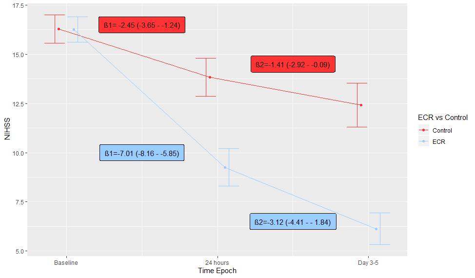
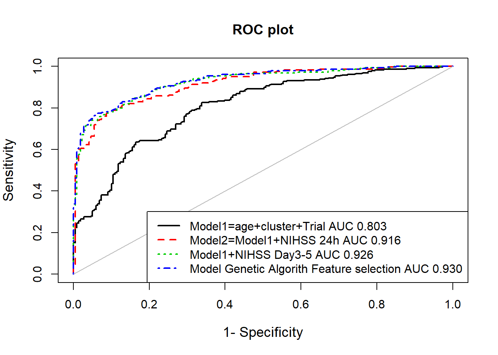
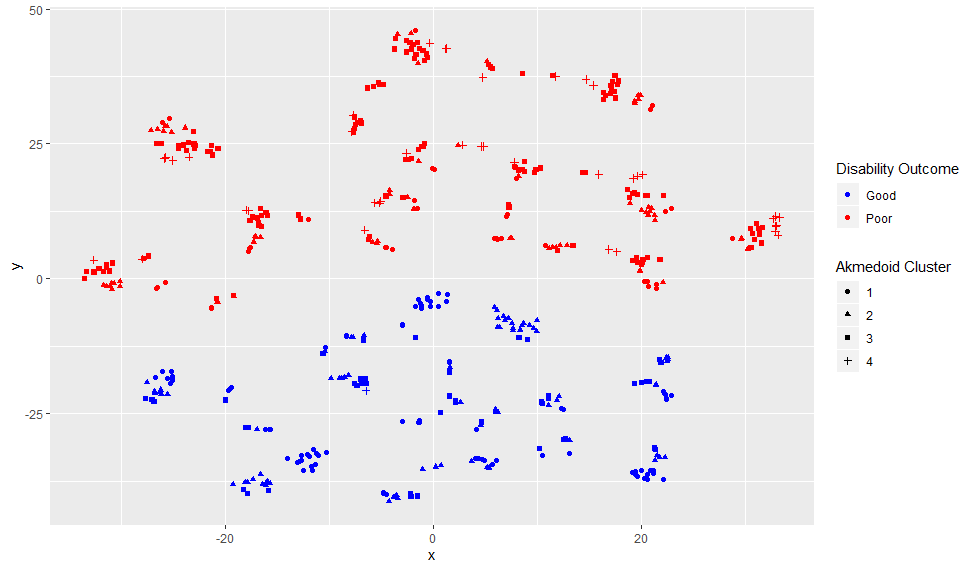

# Trajectory
Trajectory of Recovery after Stroke.
The following Rmd (text) files were used to analyse the trajectory of recovery from stroke. The data were obtained from these trials EXTEND-IA, ESCAPE, DEFUSE3. The data are not provided here but can be accessed by contacting the trial principal investigators. In the first part we explored the trajectory between baseline and 24 hours and between 24 hours and day 3 to 5. Plotting of the trajectory was performed using ggplot2 . 

In the second part, the role of group based trajectory modeling to cluster the longitudinal trajectory of stroke deificit (NIHSS performed at regular interval). The work flow pipeline is as follow, obtain the data in wide format, convert the data to long format for group based trajectory modeling (akmedoids), return the cluster back to wide format for GLM analysis. The akmedoid library initialise the trajectory based on median values. The modelings were performed with PredictABEL package to explore discrimination and calibration. 

In the third part we explored the role of genetic algorithm (caret library) to perform feature selections. Genetic algorithm is an evolutionary method based on Darwin's natural selection of the fittest species. Ideas used in genetic algorithm include mutation, crossover and selection. It is used for optimization and in this case selection of features. The feature selection was performed using random forest algorithm. The chosen features from genetic algorithm were used in GLM analysis. For this analysis, it tooks 1.7 hour on a surfacebook with 16GB RAM.. 

The fourth part deals with the use of T-distributed stochastic neighbor embedding (Rtsne). This is a very nice techniqe for visualising the high dimensional data in low dimensional space. It is a stochastic technique and the user should set a seed for reproducibility. It maps high dimensional data into low dimensions keeping the distance between similar object neighbor close and dissimilar objects apart using a probability distribution. In this respect, the technique is different from principal component analysis in which objects become further apart . 
